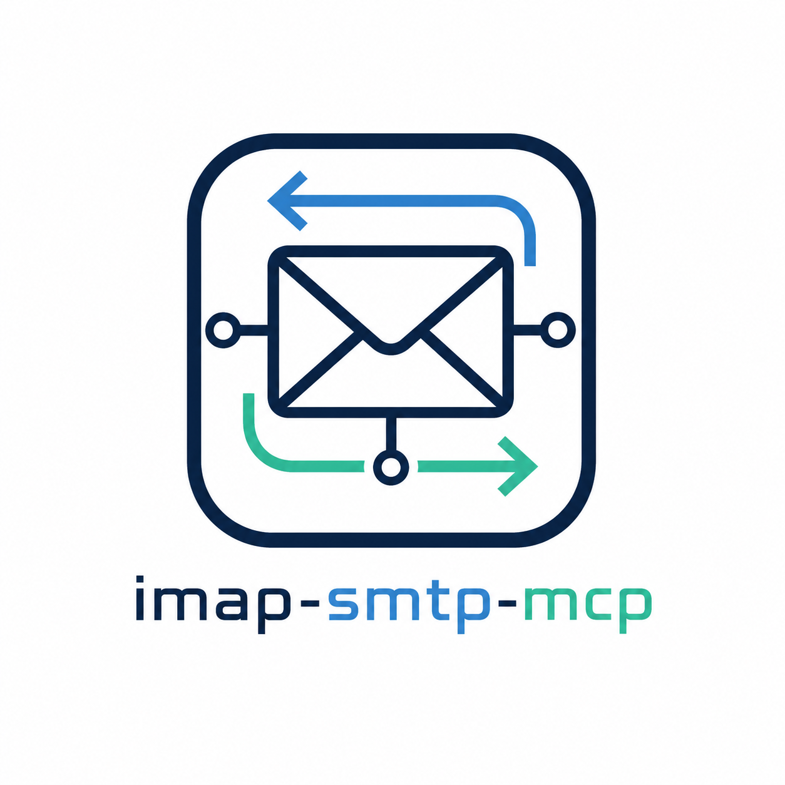

# Personal Email Connector



[](https://github.com/mrworf/imap-smtp-mcp/actions/workflows/ci.yml)
[](https://github.com/mrworf/imap-smtp-mcp/pkgs/container/imap-smtp-mcp)

`imap-smtp-mcp` advertises itself to ChatGPT as Personal Email Connector, a self-hosted MCP server that lets ChatGPT-compatible remote MCP clients use a regular IMAP and SMTP account. It exposes an HTTP MCP endpoint, handles OAuth authorization for ChatGPT, verifies users through IMAP login, and stores mailbox credentials encrypted in a local SQLite-backed OAuth store.

The intended production shape is a Docker container behind a public HTTPS reverse proxy. ChatGPT sees only the public `/sse` endpoint and the OAuth metadata endpoints; IMAP and SMTP credentials are entered during OAuth authorization and are never supplied as tool arguments.
When Gmail or another mail connector is also enabled, prompt ChatGPT with “use Personal Email Connector, not Gmail” to disambiguate this mailbox.

## What It Provides

- ChatGPT-compatible remote MCP over Streamable HTTP-style JSON-RPC at `/sse`.
- Built-in OAuth authorization-code + PKCE flow with Dynamic Client Registration.
- Separate IMAP and SMTP credentials per OAuth session.
- ChatGPT-friendly mail aliases for common search, recent-mail, and send-mail requests.
- SQLite persistence for OAuth clients, sessions, authorization codes, and refresh tokens.
- Encrypted credential storage and audit logging with secret redaction.
- IMAP folder lifecycle tools for creating, renaming, and deleting folders, guarded by write scopes and disabled-by-default action flags.
- Docker deployment with healthchecks and reverse-proxy support.

## Documentation

- [Deployment guide](docs/deployment.md): Docker, reverse proxy, direct HTTPS, OAuth secrets, and ChatGPT setup.
- [Configuration reference](docs/configuration.md): complete environment-variable reference for server and test-suite settings.
- [Example prompts](docs/example_prompts.md): safe prompts for common mail actions and full-capability smoke testing.
- [Local shell debugging](docs/local_debug.md): non-production helper for running without Docker, including reverse-proxy and standalone HTTPS modes.
- [Manual MCP compatibility suite](docs/manual_mcp_compat_suite.md): destructive end-to-end mailbox test flow.
- [Security operations](docs/security_operations.md): secrets, audit logs, OAuth cookies, and operational security notes.

## Container Image

Images are published to GitHub Container Registry:

```text
ghcr.io/mrworf/imap-smtp-mcp
```

Package page: [github.com/mrworf/imap-smtp-mcp/pkgs/container/imap-smtp-mcp](https://github.com/mrworf/imap-smtp-mcp/pkgs/container/imap-smtp-mcp)

The CI workflow runs lint, type checks, and tests first. The Docker image job runs only after those quality gates pass, and only for Docker/runtime-relevant changes merged to `main`.

## Local Debugging

For quick debugging outside Docker:

```bash
.venv/bin/python scripts/run_debug_server.py \
  --mode reverse-proxy \
  --host 127.0.0.1 \
  --port 8000 \
  --public-base-url https://mail-mcp.example.com
```

The shell helper is not a production launcher. It creates local runtime directories and may generate debug-only secrets or self-signed certificates. See [local shell debugging](docs/local_debug.md) before exposing it on a LAN/VPN interface.

## License

This project is licensed under the GNU General Public License v3.0 or later (GPL-3.0-or-later). See [LICENSE](LICENSE).
